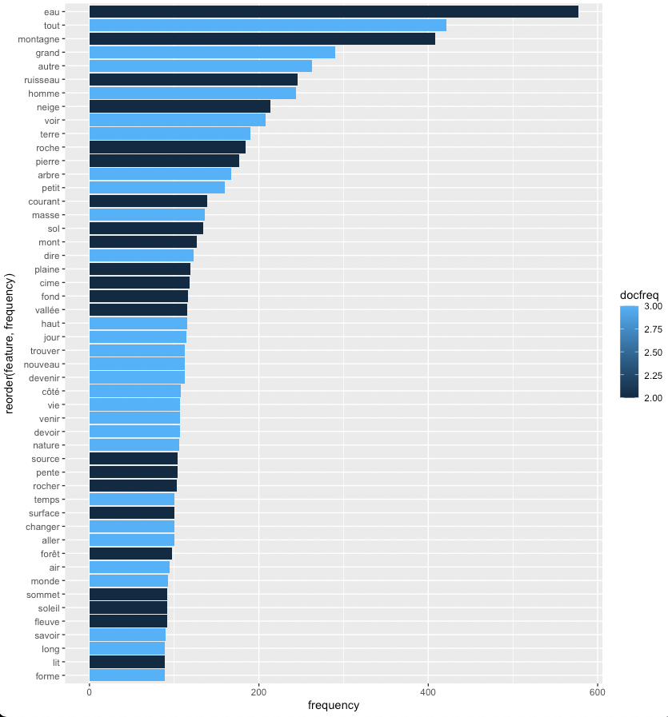
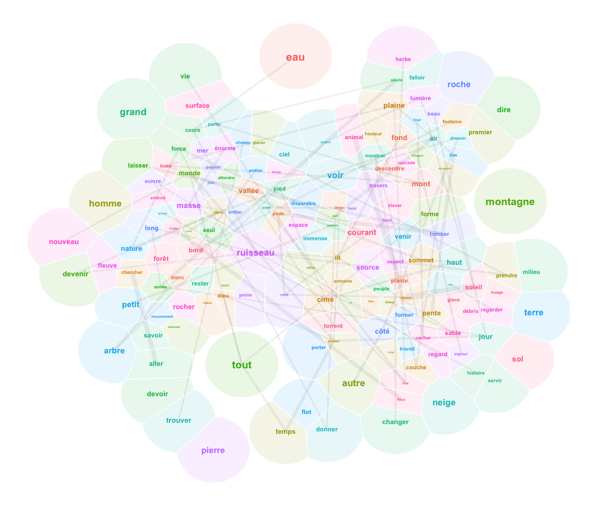
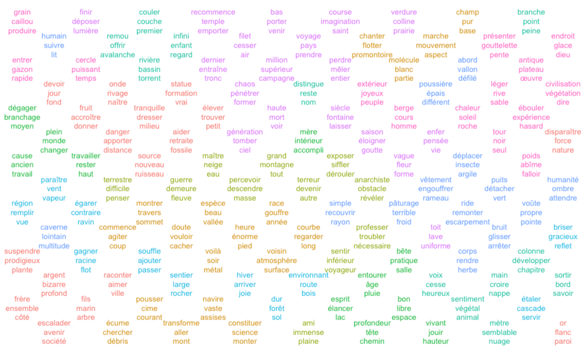
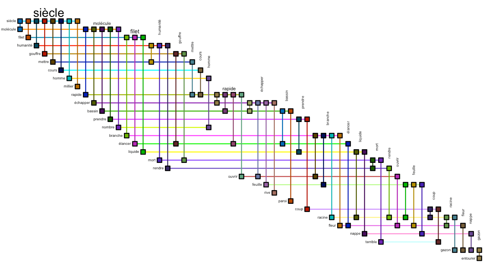

# Text2Landscape

## An R markdown notebook

The core of this repository is an [Rmd notebook](text2landscape.Rmd) that allows you to transform a corpus of texts to a landscape by the tools of computer linguistics, statistics and data visualization packages. Download it and open it in RStudio or VSCode to experiment with the code, or to apply it to your own corpus. Forks and pull requests are welcome!

[See the documentation]().

## Introduction

You will find no realistic landscapes prior to the Renaissance. The
saints of medieval murals float in a conceptual space informed by
hierarchies and symbolic relations; so do those of the Prajñāpāramitā
Sūtras. The word "landscape" appears with the Dutch painters of the 15th
century. A landscape is a part of the world perceived by a human being
at a given moment; an arrangement of features and shapes in a limited
space. The Dutch were focused on natural landscapes. Late 20th-century
urbanism deals with urban landscapes.

A text can be transformed into a landscape by the tools of computer
linguistics, statistics and data visualization packages. Here we work with the example of three texts by the French geographer, writer and anarchist [Élisée
Reclus](https://en.wikipedia.org/wiki/Élisée_Reclus): [Histoire d'une
Montagne](http://www.gutenberg.org/ebooks/60850), [Histoire d'un
ruisseau](https://www.gutenberg.org/ebooks/61697) and
[L'Anarchie](https://www.gutenberg.org/ebooks/40456).

## Visualize the frequencies

## The Text as a Network of Word Co-occurrence

### Calculate the feature co-occurrence matrix

### Visualise the graph

#### 3D variant 

### Self-organizing map from network

#### From the feature-coocurrence matrix to a positional matrix with multidemensional scaling

#### From MDS to SOM

### The biofabric layout

# Word Embeddings

### Principal Component Analysis

### Self-organizing Map

