You will find no realistic landscapes prior to the Renaissance. The
saints of medieval murals float in a conceptual space informed by
hierarchies and symbolic relations; so do those of the Prajñāpāramitā
Sūtras. The word "landscape" appears with the Dutch painters of the 15th
century. A landscape is a part of the world perceived by a human being
at a given moment; an arrangement of features and shapes in a limited
space. The Dutch were focused on natural landscapes. Late 20th-century
urbanism deals with urban landscapes.

A text can be transformed into a landscape by the tools of computer
linguistics, statistics and data visualization packages. This post shows
how to do so in R. We shall work with the example of three texts by the
French geographer, writer and anarchist [Élisée
Reclus](https://en.wikipedia.org/wiki/Élisée_Reclus): [Histoire d'une
Montagne](http://www.gutenberg.org/ebooks/60850), [Histoire d'un
ruisseau](https://www.gutenberg.org/ebooks/61697) and
[L'Anarchie](https://www.gutenberg.org/ebooks/40456).

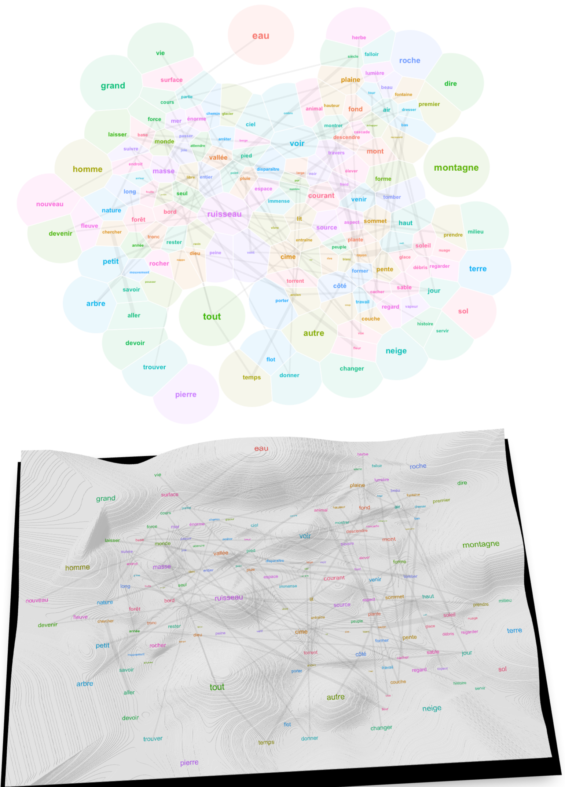

## Load the Required Packages

I suppose you are using RStudio and know how to install packages. Let us first load the appropriate packages and define some global variables, such as the number of cores on your computer for parallel processing and the path to which your results will be stored:

```{r}
library(magrittr) # provides %>% pipe operator
library(data.table) # provides an efficient data.frame model and an interesting short-hand syntax
library(stringdist) # for detecting word flexions
library(quanteda)
library(quanteda.textstats)
library(quanteda.textplots)
library(readtext)
library(ggplot2)
library(udpipe) # for lemmatization
library(igraph)
library(tidygraph) # allows for manipulation of igraph objects with a coherent syntax
library(ggraph)
library(particles) # for particle-based network layouts
library(RBioFabric) # must be installed by remotes::install_github("wjrl/RBioFabric")
library(vegan) # for efficient non-metric multidimensional scaling
library(text2vec)
library(fastcluster) # makes the hclust function much faster
library(kohonen) # Self-organizing maps
library(ggforce) # Allows to draw Voronoi tiles in any ggplot
library(akima) # Interpolates points to a raster, allowing to create a pseudo-DEM (digital elevation model)
library(rgl) # 3D grahics
library(rayshader) # Rendered 3D graphics with raytracing
ncores <- parallelly::availableCores() # determine the number of cores on your computer; we'll use this value in functions supporting multicore processing.
basepath <- rstudioapi::getActiveDocumentContext()$path %>% dirname
```

## Import a text corpus

Now, let us load our texts from the Guttenberg repository.

```{r}
text <- readtext(c(
	"http://www.gutenberg.org/files/60850/60850-0.txt", 
	"https://www.gutenberg.org/cache/epub/61697/pg61697.txt",
	"https://www.gutenberg.org/cache/epub/40456/pg40456.txt"
)) 
```

We [lemmatize](https://en.wikipedia.org/wiki/Lemmatisation) the corpus
with the *udpipe* package, using [parallel computing for faster
execution](https://cran.r-project.org/web/packages/udpipe/vignettes/udpipe-parallel.html).
We use the pre-trained French udpipe language model for lemmatization.
For convenience, we store the model to the directory containing the
current script, so that we don't always re-download it from the web
repository if we rerun the code. Also, since the lemmatization algorithm
takes time, we save the result to a local file that you can simply load
later on.

```{r}
udmodelfile <- file.path(basepath,"french-gsd-ud-2.5-191206.udpipe")
if (udmodelfile %>% file.exists){
udmodel<- udpipe_load_model(udmodelfile)
} else {
udmodel <- udpipe_download_model(language = "french",model_dir = basepath)
}
text.lemmas <- udpipe(text,object = udmodel, parallel.cores = ncores) %>% as.data.table
save(text.lemmas,file=file.path(basepath,"text_lemmas.RData"))
```

If you have already run the code above, simply load the result.

```{r}
load(file.path(basepath,"text_lemmas.RData"))
```

Let us have a look at the table of lemmas:

```{r}
text.lemmas[,c("doc_id","sentence_id","token","lemma","upos")] %>% head(30)
```

------------- ------------- -------------- -------------- -------
doci_id       sentence_id   token          lemma          upos
pg40456.txt   1             The            The            X
pg40456.txt   1             Project        Project        X
pg40456.txt   1             Gutenberg      Gutenberg      X
pg40456.txt   1             EBook          EBook          X
pg40456.txt   1             of             of             X
pg40456.txt   1             L'             le             DET
pg40456.txt   1             anarchie       anarchie       NOUN
pg40456.txt   1             ,              ,              PUNCT
pg40456.txt   1             by             by             ADP
pg40456.txt   1             Élisée         Élisée         PROPN
pg40456.txt   1             Reclus         reclus         PROPN
pg40456.txt   2             This           This           PROPN
pg40456.txt   2             eBook          eBook          PROPN
pg40456.txt   2             is             is             VERB
pg40456.txt   2             for            for            X
pg40456.txt   2             the            the            X
pg40456.txt   2             use            user           VERB
pg40456.txt   2             of             of             X
pg40456.txt   2             anyone         anyone         X
pg40456.txt   2             anywhere       anywhere       X
pg40456.txt   2             at             at             X
pg40456.txt   2             no             no             X
pg40456.txt   2             cost           cost           X
pg40456.txt   2             and            and            X
pg40456.txt   2             with           with           X
pg40456.txt   2             almost         almost         X
pg40456.txt   2             no             no             X
pg40456.txt   2             restrictions   restrictions   X
pg40456.txt   2             whatsoever     whatsoever     X
pg40456.txt   2             .              .              PUNCT
------------- ------------- -------------- -------------- -------

As you can see, there is a lot of preliminary text (copyright, editorial
notes, etc.) and appendices (table of contents, further editorial
notes). We want to isolate the core of the text, a task simplified by
the fact that udpipe provides sentence ids. If you work on another text,
you must conceive your own data cleaning strategy.

```{r}
text.lemmas <- text.lemmas[
	(doc_id =="60850-0.txt" & sentence_id > 16 & sentence_id < 1800) |
	(doc_id =="pg61697.txt" & sentence_id > 21 & sentence_id < 1472) |
	(doc_id =="pg40456.txt" & sentence_id > 18 & sentence_id < 219)
] 
text.lemmas[,c("sentence_id","token","lemma","upos")] %>% head(30) 
```

------------- ------------- -------------- -------------- -------
doci_id       sentence_id   token          lemma          upos
pg40456.txt   19            L'             le             DET
pg40456.txt   19            anarchie       anarchie       NOUN
pg40456.txt   19            n'             ne             ADV
pg40456.txt   19            est            être           AUX
pg40456.txt   19            point          poindre        VERB
pg40456.txt   19            une            un             DET
pg40456.txt   19            théorie        théorie        NOUN
pg40456.txt   19            nouvelle       nouvelle       ADJ
pg40456.txt   19            .              .              PUNCT
pg40456.txt   20            Le             le             DET
pg40456.txt   20            mot            mot            NOUN
pg40456.txt   20            lui-même       lui-même       PRON
pg40456.txt   20            pris           prendre        VERB
pg40456.txt   20            dans           dans           ADP
pg40456.txt   20            l'             le             DET
pg40456.txt   20            acception      acception      NOUN
pg40456.txt   20            d'             de             ADP
pg40456.txt   20            «              «              PUNCT
pg40456.txt   20            absence        absence        NOUN
pg40456.txt   20            de             de             ADP
pg40456.txt   20            gouvernement   gouvernement   NOUN
pg40456.txt   20            »              »              PUNCT
pg40456.txt   20            ,              ,              PUNCT
pg40456.txt   20            de             de             ADP
pg40456.txt   20            «              «              PUNCT
pg40456.txt   20            société        société        NOUN
pg40456.txt   20            sans           sans           ADP
pg40456.txt   20            chefs          chef           NOUN
pg40456.txt   20            »              »              PUNCT
pg40456.txt   20            ,              ,              PUNCT
------------- ------------- -------------- -------------- -------

## First visualizations: frequencies

Let us first visualize word frequencies. We can get these frequencies
with the quanteda package, which implies transforming the column of
lemmas (`text.lemmas$lemma`) into a quanteda tokens object, then to a
document-feature matrix. Doing so, we only retain significant parts of
phrases (nous, proper nouns, verbs and adjectives). This only partially
spares us the task of removing stopwords: some auxiliary and weak verbs,
such as "avoir", "être" and "pouvoir" should be removed as they are
frequent in *any* text. We also remove words that udpipe failed to
recognize as an unwanted part of speech (e.g., a determinant like "le"
wrongly detected as noun). The main point of looking at a frequency
table is to spot words that only add noise to the analysis.

```{r}
mystopwords <- c("avoir","être","pouvoir","faire","sembler","même","et","un","une","le","la","les","de","il","ils","elle","elles","pour","par","tel","quel","sorte","pendant","Le","La","vers","sans","à","-un","fois","chose",letters,LETTERS)
tokens.selected <- text.lemmas[upos %in% c("NOUN","PROPN","ADJ","VERB"), c("doc_id","lemma")][,.(text = paste(lemma, collapse=" ")), by = doc_id] %>% corpus %>%
	tokens(remove_punct=TRUE) %>%
	tokens_remove(mystopwords)
dfm.selected <- tokens.selected %>% dfm(tolower = FALSE) # lemmatization has already lower-cased what needs to be, thus tolower = FALSE
wordfreqs <- dfm.selected %>% textstat_frequency %>% as.data.table %>% setorder(-frequency) 
```

Before viewing the frequencies, you might want to reduce the variety of
different tokens (individual lemmas), by grouping word flexions that
udpipe missed.

### Find and group word flexions

If you have a large corpus of over a million lemmas, you can skip this
part to the section "Visualize the Frequencies". In a large corpus,
chances are great that related words like *montagne*, *montagnes* and
*montagneux* end up together in your landscape. They will co-occur with
similar words that, in turn, will pull them together in all the
algorithms that we are about to see. But here I don't have a million
lemmas, only 133443 (the number of rows of the `text.lemmas` object);
actually only 47335 (the number of rows of the subset of lemmas
containing only nouns, verbs and adjectives
`text.lemmas[upos %in% c("NOUN","PROPN","ADJ","VERB")]`). In text
mining, that is a miniature corpus! We are at the very edge of all hopes
for statistical significance. We need to group similar words to make
significant observations of word co-occurrence more likely. Normally,
udpipe should have grouped word flexions and lower-cased all common
nouns: the fact is that it doesn't do a 100% accurate job. We can find
help in the
[stringdist](https://cran.r-project.org/web/packages/stringdist/index.html)
package. It provides the function `stringdistmatrix` that generates a
matrix of *string dissimilarities* between all pairs of lemmas. There
are many ways to calculate such a dissimilarity. The best for our
purpose is the "Jaro distance", a number between 0 (exact match) and 1
(completely dissimilar). It "accounts for the length of strings and
partially accounts for the types of errors typically made in
alphanumeric strings by human beings" ([Winkler
1990](https://files.eric.ed.gov/fulltext/ED325505.pdf)). You can find
more info on this metric in the [stringdist package
documentation](https://cran.r-project.org/web/packages/stringdist/stringdist.pdf),
have a look at the [source
code](https://github.com/markvanderloo/stringdist/blob/master/pkg/src/jaro.c),
[at the Wikipedia
entry](https://en.wikipedia.org/wiki/Jaro%E2%80%93Winkler_distance) or
at a [paper from 1990](https://files.eric.ed.gov/fulltext/ED325505.pdf)
worthwhile for its retro aesthetics.

Let us calculate the Jaro distance for all words accounted for in the
`wordfreqs` table:

```{r}
tokens.dissimilarity <- stringdist::stringdistmatrix(wordfreqs$feature,nthread=ncores, method="jw")
names(tokens.dissimilarity) <- wordfreqs$feature
tokens.dissimilarity.df <- tokens.dissimilarity %>% as.matrix %>% Matrix::forceSymmetric(., uplo="U") %>% as.matrix %>% as.data.frame
```

Once I have the `tokens.dissimilarity` matrix, I feed it to a convenience function `flexionsf` that generates a list of flexions for every word that has any. This function takes a long time, so fetch a coffee while running it and save the result to your hard drive!

```{r}

flexionsf <- function(x,d,take=nrow(x)){ # x is the named symmetric distance matrix, d is the maximum distance at which words are considered as synonyms, the take parameter is for testing purposes. It limits the fucnction to a subset of 1:take words from the distance matrix
	nchars <- nchar(colnames(x))
	temp <- lapply(rownames(x)[1:take], function(w) { # y is the current word
		if(grepl("^[[:upper:]]", w)) {return(NULL)} # Do not add a key to the dictionary if it is capitalized
		selector <- unname(
			(x[w,] < d | w == tolower(colnames(x))) & 
			nchar(w) <= nchars # only add words that are longer than the current dictionary key
		)[1,]
		if ( length(wordfreqs[selector,feature]) > 1 ) { # only add the word if it has more than one synonym 
			return(wordfreqs[selector,feature])
		} else {
			return(NULL)
		}
	})
	names(temp) <- rownames(x)[1:take]
	temp[!sapply(temp, is.null)]
}
if(FALSE){
	flexions.list <- flexionsf(tokens.dissimilarity.df,0.04) 
	save(flexions.list,file=file.path(basepath,"flexions_list.RData"))
}
flexions.list %>% head(10)
```

A printout of the first 10 entires gives you an idea of what you get:

```
$eau
[1] "eau" "Eau"
$montagne
[1] "montagne"  "montagnes"
$grand
[1] "grand" "Grand"
$neige
[1] "neige" "Neige"
$terre
[1] "terre" "Terre"
$roche
[1] "roche" "Roche"
$pierre
[1] "pierre" "Pierre"
$nouveau
[1] "nouveau" "Nouveau"
$soleil
[1] "soleil" "Soleil"
$descendre
[1] "descendre"  "descendire"
```

You can then easily transform the list of flexions to a quanteda dictionnary, that you apply to the tokens object:

```{r}
load(file.path(basepath,"flexions_list.RData"))
flexions.dict <- flexions.list %>% dictionary(tolower=F)
tokens.selected <- tokens.selected %>% tokens_lookup(flexions.dict, exclusive=F, capkeys = F, case_insensitive = F)
dfm.selected <- tokens.selected %>% dfm(tolower = FALSE) # lemmatization has already lower-cased what needs to be, thus tolower = FALSE
wordfreqs <- dfm.selected %>% textstat_frequency %>% as.data.table %>% setorder(-frequency) # automatically sets the order in reverse
```

That's it, your flexions are grouped and your list of distinct words (`wordfreqs`) is now a little shorter.

```{r}
if(FALSE){
test <- udpipe("Je marchais devant moi, suivant les chemins de traverse et m'arrêtant le soir devant les auberges écartées",object = udmodel, parallel.cores = ncores) %>% 
	as.data.table %>%
	.[upos %in% c("NOUN","PROPN","ADJ","VERB"), c("doc_id","lemma")]
test <- test[,.(text = paste(lemma, collapse=" ")), by = doc_id] 
	test %>% corpus %>%
	tokens(remove_punct=TRUE) %>%
	tokens_remove(mystopwords)
}
```

### Visualize the frequencies

We are ready to visualize our results as a bar chart. Doing so, using
docfreq, the count of documents in which words occur, as fill color can
help you distinguish words specific to some documents to words present
in all of them :

```{r}
ggplot(wordfreqs%>%head(50)) + 
	geom_col(aes(y=frequency,x=reorder(feature,frequency),fill=docfreq)) + 
	coord_flip()
```

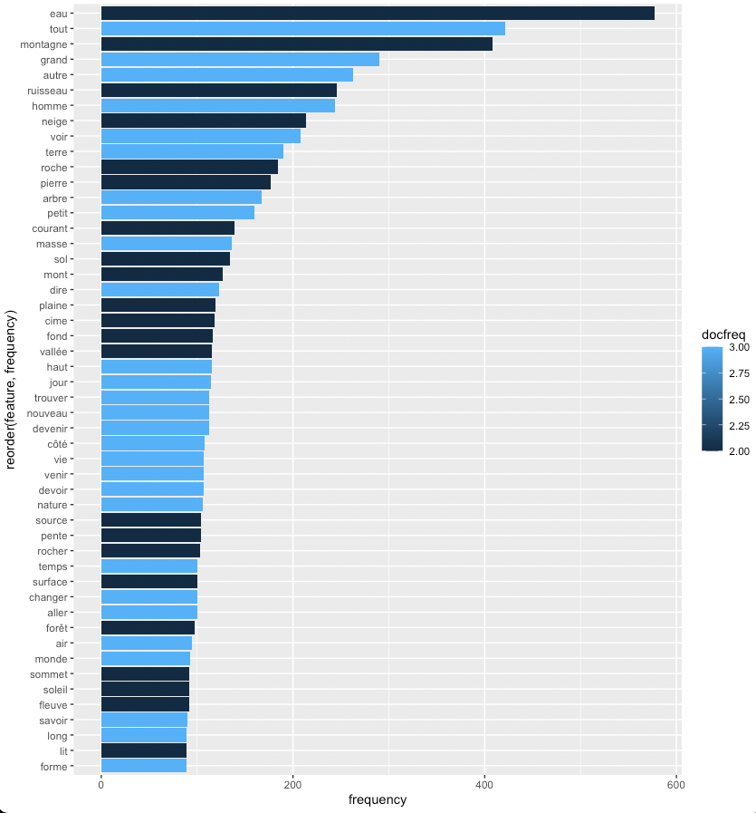

We can also show the exact same frequencies as a word cloud:

```{r, dpi=300}
textplot_wordcloud(dfm.selected)
```

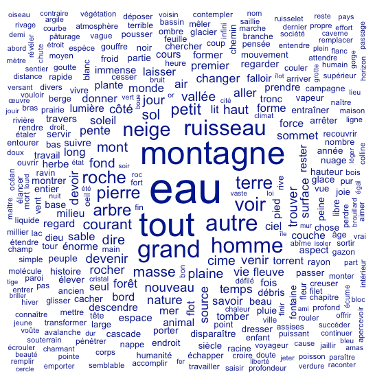

I advise against word clouds in academic publications and serious blogs. Word clouds are fancy and sometimes pretty; you can use them to impress your boss if you work for a tabloid or for a corporate communication office, but they give limited insight into the actual distribution of word frequencies. The relative positions of words in a word cloud has strictly no meaning. We can put space to better use by making it convey actual information. 

## The Text as a Network of Word Co-occurrence

### Calculate the feature co-occurrence matrix

One way to do so is to visualize a force-directed network of feature
concurrences. We need a feature concurrence matrix (FCM) first.

```{r}
fcm.selected <- fcm(tokens.selected, context="window", count="weighted", window=2) %>% fcm_remove(wordfreqs[frequency<5,feature],case_insensitive=F)
fcm.selected %>% head(10)
```

An FCM is a square matrix giving the counts of co-occurrences within a
certain "window" for each pair of words found in your text. By default
in quanteda, the window takes 5 words before and 5 words after. Since I
have stripped many stopwords, I reduce the width of the window to 2.
Take the phrase "*Je marchais devant moi, suivant les **chemins** de
traverse et m'arrêtant le soir devant les auberges écartées*". Once
lemmatized and stripped of stopwords, it reads "*[marcher suivre
**chemin** traverse arrêter ]{.underline
style="text-decoration: underline"}soir auberge écarter*". The word
"chemin" thus co-occurs with *marcher*, *suivre*, *traverse* and
*arrêter* in a window of width 2. To make the FCM more pertinent, we can
weight by proximity. This means that "suivre" and "traverse" co-occur
more strongly whith "chemin" than "marcher" and "arrêter". Finally, we
exclude words that occur only once in the text, as no recurrence of
co-occurrence can be observed in their case; in a larger corpus, for
greater statistical significance, you should remove all words that do
not reccur at least 10 times.

Unless you specify otherwise, the FCM is a *triangular* matrix, meaning
it is asymetric and -- in graph language -- undirected; only the upper
half contains data. This makes sense, as the coocurrence between A and B
is the same as the coocurrence between B and A:

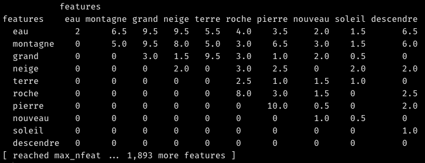

For later use, though, we'll need a symmetric version of the FCM matrix.
Let us also calculate a *weighted FCM*. By this, I mean an FCM in which
the co-occurrence of a given word with any other is always divided by
its frequency or, more precisely, by the sum of the row of
co-occurrences of that given word (`rowSums(fcm.selected.symmetric)`).
In this way, we make sure that very frequent words such as *montagne* or
*eau* do not dominate the result making the positions of weaker
connections arbitrary.

```{r}
fcm.selected.symmetric <- Matrix::forceSymmetric(fcm.selected, uplo="U") # The matrix has to be made symmetric for igraph to be able to treat it as undirected
fcm.selected.weighted <- fcm.selected / rowSums(fcm.selected.symmetric)^0.9
fcm.selected.symmetric.weighted <- Matrix::forceSymmetric(fcm.selected.weighted, uplo="U")
```

### Visualise the graph

Since an FCM is very exactly a matrix of links between words, you can
directly visualize it as a network:

```{r, dpi=300}
fcm_select(fcm.selected.weighted, pattern=topfeatures(fcm.selected.weighted, 50) %>% names, selection = "keep") %>% textplot_network
```

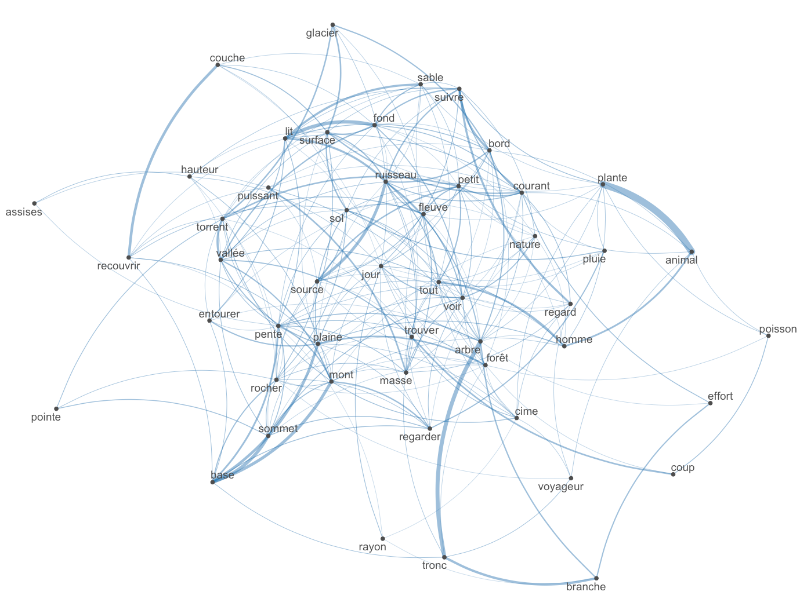

We can see if not interesting, at least reassuring patterns. Élisée
Reclus has obviously spoken of "plants and animals". The branch is tied
to the trunc which is part of a tree (*branche*, *tronc*, *arbre*). The
*ruisseau* has a *source* and becomes a *fleuve*. The *base* leads to
the top (*sommet*). Yes, Élisée Reclus writes about natural landscapes.
Interstingly, his anarchist concerns hide deeper in this fabric of
natural forms.

For more control over the network layout, you can use igraph,
[tidygraph](https://www.data-imaginist.com/2017/introducing-tidygraph/)
and ggraph:

```{r}
g <- graph_from_adjacency_matrix(fcm.selected.symmetric.weighted, weighted=TRUE, diag = F, mode="undirected") %>% as_tbl_graph
# join frequency data from wordfreqs
setkey(wordfreqs,"feature")
V(g)$freq <- wordfreqs[V(g)$name,frequency]
# create groups
V(g)$group <- cluster_leiden(g) %>% membership %>% as.character

g.top <- g %>%  
	activate(nodes) %>% 
	arrange(-freq) %>% 
	slice(1:500) # we use only the top 500 nodes for the layout, we hide some afterwards

g.laidout <- g.top %>% create_layout(layout="igraph",algorithm="drl") # Distributed Recursive (Graph) Layout 2008 

mr <- max(g.laidout$x,g.laidout$y) / 10 # adapt the voronoi max radius size to the extent of the actual data
mw <- min(E(g)$weight) + (max(E(g)$weight) - min(E(g)$weight)) * 0.08
ggraph(g.laidout %>% slice(1:100)) +
	geom_edge_link(aes(width=ifelse(weight<mw,0,weight)),alpha=0.2,color="grey",show.legend = F) +
	scale_edge_width('Value', range = c(0.1, 1)) + 
	geom_node_voronoi(aes(fill = group), alpha=0.1, max.radius = mr, colour = "white",show.legend = F) + 
	geom_node_text(aes(label=name,size=log(freq),color=group),fontface = "bold",show.legend = F) +
	theme_void()

```

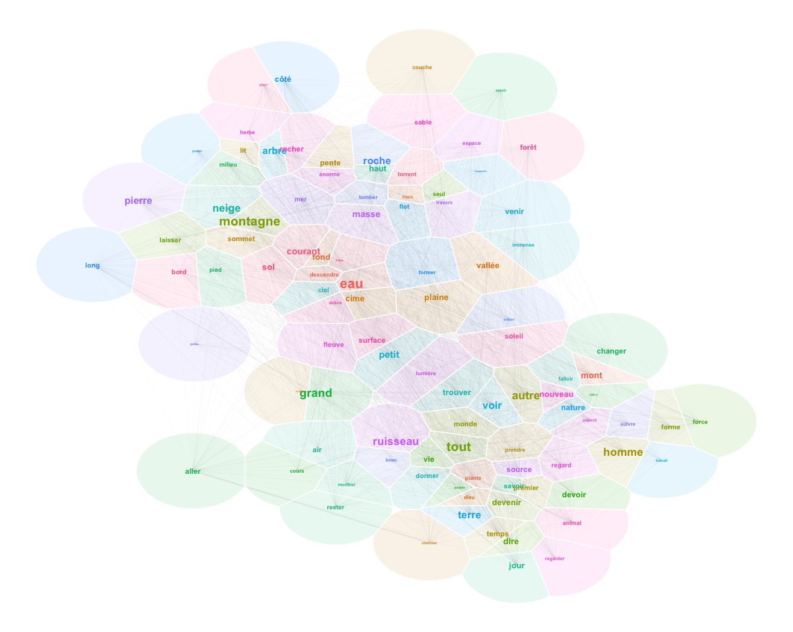

Unfortunately, even the most recent force-directed graph layout
algorithm in igraph -- the distibuted recursive layout -- dates back to
2008. None of igraph's algorithms manage the *collision force* that
prevents nodes from overlapping and that leaves space for large nodes.
Fortunately, the [*particles*
package](https://cran.r-project.org/web/packages/particles/vignettes/intro.html)
allows you to do exactly that by providing all forces from the wonderful
D3 force-directed algorithm. We owe the R package notably to Thomas Lin
Pedersen, also main author of
[tidygraph](https://www.data-imaginist.com/2017/introducing-tidygraph/),
ggraph and [ggforce](https://ggforce.data-imaginist.com/).

```{r}
g.laidout2 <- g.top %>% 
  simulate() %>% 
  wield(link_force, strength=weight, distance=1/weight) %>% 
  wield(manybody_force) %>% 
  #wield(center_force) %>%
	wield(collision_force,radius=freq^1) %>%
  evolve() %>% 
  as_tbl_graph() %>% 
	create_layout(layout="manual",x=x, y=y) %>% # forward the words to the layout
	slice(1:150) # we show only a subset of words once layed out

mr <- max(g.laidout2$x,g.laidout2$y) / 6 # adapt the voronoi max radius size to the extent of the actual data
mw <- min(E(g)$weight) + (max(E(g)$weight) - min(E(g)$weight)) * 0.08
ggraph(g.laidout2) +
	geom_edge_link(aes(width=ifelse(weight<mw,0,weight)),alpha=0.2,color="grey",circular=F,show.legend = F) +
	scale_edge_width('Value', range = c(0, 5)) + 
	geom_node_voronoi(aes(fill = group), alpha=0.1,colour = "white",show.legend = F, max.radius = mr) + # passes arguments to ggforce::geom_voronoi_tile , colour = "white"
	geom_node_text(aes(label=name,size=log(freq),color=group),fontface = "bold",show.legend = F) +
	theme_void()

```

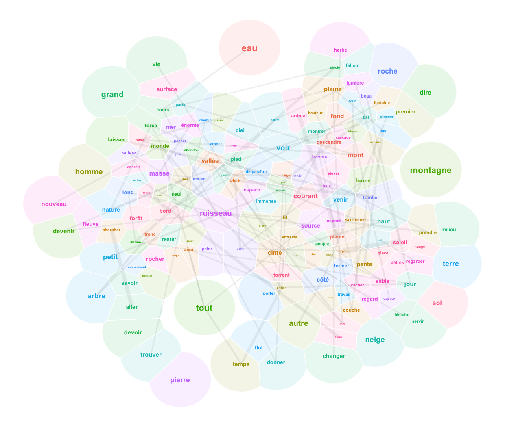

We finally have a landscape that we can read. To understand it, consider
a couple of unerlying choices. First, I made the algorithm account for
*all* of the relations between 494 words when calculating the layout,
*even if* I finally display only 150 of them for the sake of
readability. This means that the topology of the graph is subject to
underlying forces that explain why certain words became neighbors
despite their showing no *visible* relation. Trust the algorithm and on
this one: what is close in this landscape is really related, like in the
"law of geography" of Waldo Tobler. Second, to complement the
topological relations given by word positions in the 2D space, I show
also lines denoting strong links (linked words co-occur frequently).
This allows us to keep track of strongly related words that have been
separated by the underlying forces. Typically, this leaves a trace of
expressions like "*cours d'eau*", "*trouver son chemin*", "*tout le
temps*", "*tout le monde*", "*petit nombre*", "*rayon de soleil*", "*le
vent et la pluie*" etc.

Now look at the words surrounding the main elements. The lively brook,
born out of the rain flows through the gully (*vivre*, *ruisseau*,
*ravin*, *pluie*). The verb *vivre* connects to life, an aspect of water
(*vie*, *eau*) (less esoterically, *l'eau de vie* in French means
"brandy"). Paths and grass surround water surfaces (*chemin*, *herbe*).
Animals drik water. Water flows out of the glacier. Mountains are
elevated forms; they bathe high (*haut*), in the sun (*soleil*) and
clouds (*nuage*). Things fall from the mountaintops (*tomber*,
*sommet*)... Very prosaic.

Interpreting a text landscape consists in walking the thin edge between
overinterpretation and dullness. With a different set of parameters in
the preceding algorithms applied to the same corpus, I've obtained the
following map:

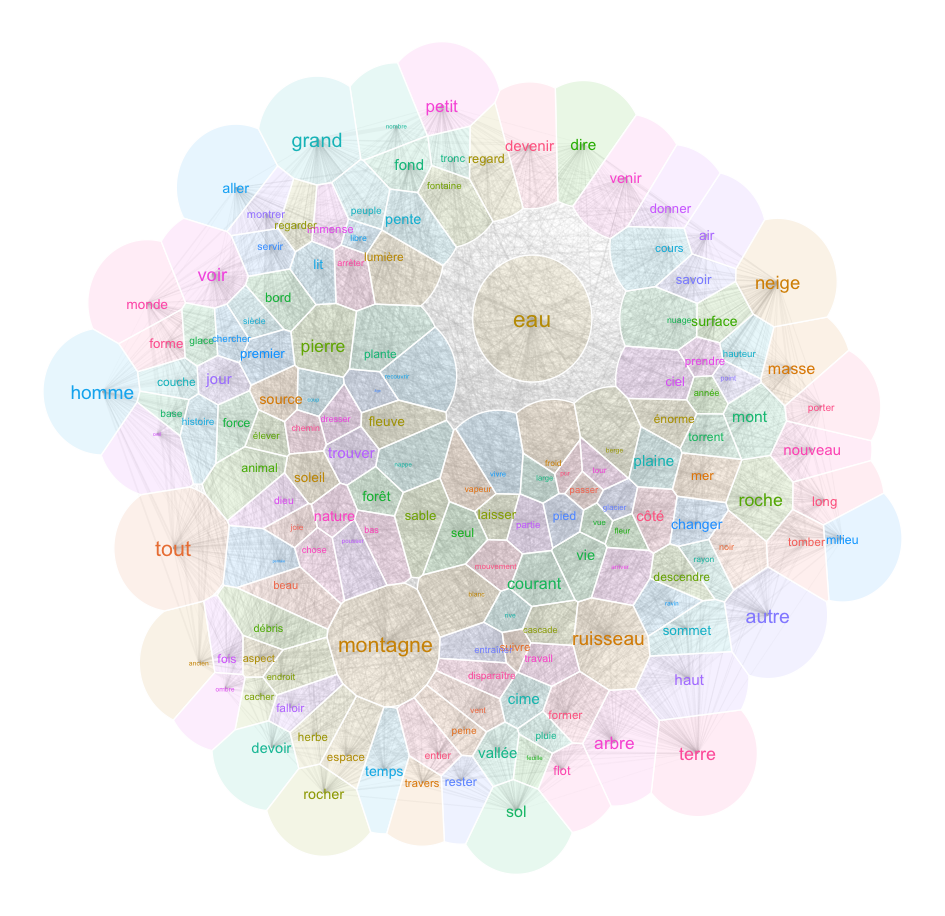

Water is cold, surrounded by light and verbs of movement. The mountain
is a lonely and beautiful place made of rocks and debris exposed to the
winds; it makes you conscious of space and time...

### 3D variant 

Let us add a third dimension to stress the frequency of words. This can
be done by creating a pseudo-DEM (digital elevation model) interpolating
between points whose heights are given by word frequencies. You'll find
the most frequent words on hilltops.

```{r dpi=300, fig.height=10}
# Prepare raster extent ----
xleft <- min(g.laidout2$x)-mr/2
xright <- max(g.laidout2$x)+mr/2
yupper <- max(g.laidout2$y)+mr/2
ylower <- min(g.laidout2$y)-mr/2
# interpolate the points to a a raster, with sampling frequency nx X ny ---
# Note that the original coordinates of the points are preserved 
pointheight.raster <- interp( 
	x = g.laidout2$x, 
	y = g.laidout2$y, 
	z = g.laidout2$freq,
	xo = seq(xleft,xright,by=(xright-xleft)/1500),
	yo = seq(ylower,yupper,by=(yupper-ylower)/3000),
	linear = FALSE,
	extrap = TRUE, # works for non-linear only; if false creates a convex hull that removes points at the edges
	duplicate = "strip"
)
pointheight.raster.dt <- interp2xyz(pointheight.raster) %>% as.data.table %>% setnames("z","freq")
if (nrow(pointheight.raster.dt[freq<0]) > 0) { # necessary if the interpolation has produced negative values	
	pointheight.raster.dt[,freq:=freq-min(freq,na.rm=TRUE)] # NB: -(-x) = +x
}
pointheight.raster.dt[is.na(freq),freq:=min(pointheight$freq)]

terrain_palette <- colorRampPalette(c("#f0f0f0","white"))(256)
gplot3d <- ggraph(g.laidout2) +
	geom_raster(data=pointheight.raster.dt, aes(x=x, y=y, fill=freq^0.5),interpolate=TRUE, show.legend = F) +
	scale_fill_gradientn(colours=terrain_palette) +
	geom_edge_link(aes(width=ifelse(weight<mw,0,weight)),alpha=0.2,color="grey",circular=F,show.legend = F) +
	scale_edge_width('Value', range = c(0, 5)) + 
	geom_node_text(aes(label=name,size=log(freq),color=group),show.legend = F) +
	theme_void()
gplot3d

rayshader::plot_gg(
	gplot3d, width=15, height=10, multicore = TRUE,
	raytrace=TRUE, 
	scale = 500, # default is 150
	# preview = TRUE,
	windowsize = c(1600, 1000),
  fov = 70, zoom = 0.4, theta = -3, phi = 75
) 
# rayshader::render_camera(fov = 70, zoom = 0.4, theta = -3, phi = 75)
rayshader::render_snapshot(file.path(basepath,"network3d.png"),width=160, height=100)
rgl.close()
```

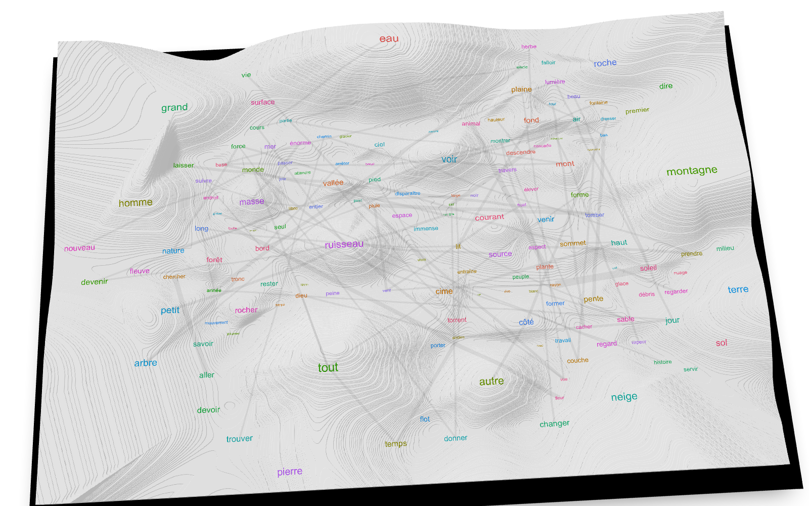

As you see, we cannot keep the Voronoi tiles overlay in the 3D map.
Because ggplot *just won't let you* combine a discrete and a continuous
color scale, and since we need a discrete color scale for the Voronoi
tiles and a continuous color scale to feed to `rayshader::plot_gg` to
make the heights... Perhaps it is better that way, but for the record,
topographical maps always mix discrete and continuous color scales; many
have already tried to convince the developers of ggplot... Some [have
found
workarounds](https://stackoverflow.com/questions/11508902/plotting-discrete-and-continuous-scales-in-same-ggplot)
that unfortunately won't work for us in combination with rayshader.

### Self-organizing map from network

One annoying problem with force-directed networks is that words that
might have a strong co-occurrence are pulled appart because of their
connections to other words, themselves far apart in the text. If you
keep your FCM window tight, this is not so much of a problem. But the
true topology of a force-directed network could only be fully respected
in a high-dimensional space. And we only have two dimensions to work
with in a visual representation. One workaround is to use a
self-organizing map.

Self-organizing maps (SOM) allow to place words in a more readable
two-dimensional space, since each word is associated to a position in a
predefined grid (square or hexagonal). The very goal of the SOM
algorithm is to preserve topology as much as possible in a bidmensional
space.

The *kohonen* package facilitees the creation of SOMs in R... but there
is a caveat: the `kohonen::som` function only eats positional matrices.
Each word in a positional matrix has a series of coordinates in a
multidemensional space. In computational linguistics, we have no such
thing. All we have for now is an FCM, i.e. a matrix of word
coocurrences. We need to transform it into a positional matrix. To do
so, we need *multi-dimensional scaling* (MDS).

#### From the feature-coocurrence matrix to a positional matrix with multidemensional scaling

##### Calculating the distance matrix

MDS is also known as *principal coordinates analysis*. It transforms a
matrix of distances between elements into a positional matrix, in which
each element gets a position in a n-dimensional space.\
There comes another caveat, since our `fcm.selected.symmetric` matrix is
a *proximity* matrix, telling us how intense a relation between each
pair of words is, i.e, how *close* they are to each other. We need to
create a *distance matrix* by reversing the proximity matrix
(`1/fcm.selected.symmetric`). For example, if the FCM has the
co-occurrence = 3 for A and B, than the distance between A and B will be
1/3. Of course, for any pair of words that never co-occur, we'll get
`1/0` which is undefined in arithmetics. In R, `1/0 = Inf`. MDS cannot
work with infinity; we need to define actual values. So let us assign 0
to the diagonal of the matrix (distance of words to themselves) and a
large arbitrary number (`max(fcm.selected) * 3`) as the distance between
words that never co-occur:

```{r}
g.dist <- 1/fcm.selected.symmetric.weighted
diag(g.dist) <- 0 # distance of a word to itself is always 0
g.dist[g.dist==Inf] <- max(fcm.selected) * 3
```

You may notice that the operation above inflates the memory size of the
FCM from 3Mb to 600Mb! The reason is that our FCM is a [sparse
matrix](https://en.wikipedia.org/wiki/Sparse_matrix). Now that we've
replaced our Inf values outside of the diagonal by
(`max(fcm.selected) * 3`) to construct our distance matrix, its
sparsness has dramatically decreased. That's life. In difference to
proximity matrices that are mostly composed of zeros, distance matrices
hold values even for pairs of the most unrelated elements. Our only
tools to deal with it is patience or very efficient algorithms. In base
R you have `cmdscale`. The [SMACOF
package](https://cran.r-project.org/web/packages/smacof/index.html)
provides a utility funciton (`smacof::gravity`) able to transoform a FCM
into a distance matrix by using a gravity model. I chose to work with
the `monoMDS` function from the [*vegan*
package](https://cran.r-project.org/web/packages/vegan/index.html).

##### Vegan MDS

The `monoMDS` function applies non-metric multidimensional scaling
(NMDS). "Non-metric" means that the algorithm does not care much about
the actual distances between words in the distance matrix: it is content
with *relative* distances. If A is nearer to B than to C, it will remain
so in the new space. This algorithm is rather fast.

```{r}
options(mc.cores = ncores) 
mdsfit2 <- vegan::monoMDS(g.dist %>% as.dist,k=5) # non-metric
save(mdsfit2,file=file.path(basepath,"mdsfit2.RData"))
```

We can have a look at the first two dimensions

```{r}
load(file=file.path(basepath,"mdsfit2.RData"))
g.mds.points <- mdsfit2$points
g.mds.points.dt <- g.mds.points%>%as.data.table
g.mds.points.dt[,lemma:=rownames(g.mds.points)]
g.mds.points.dt[,freq:=wordfreqs[lemma,frequency]]
g.mds.points.dt[,clust:=kmeans(mdsfit2$points, 3)$cluster %>% as.character]
temp <- g.mds.points.dt %>% setorder(-freq) %>% head(100)
ggplot(temp) + geom_text(aes(x=MDS1,y=MDS2,label=lemma, size=freq,color=clust))
```

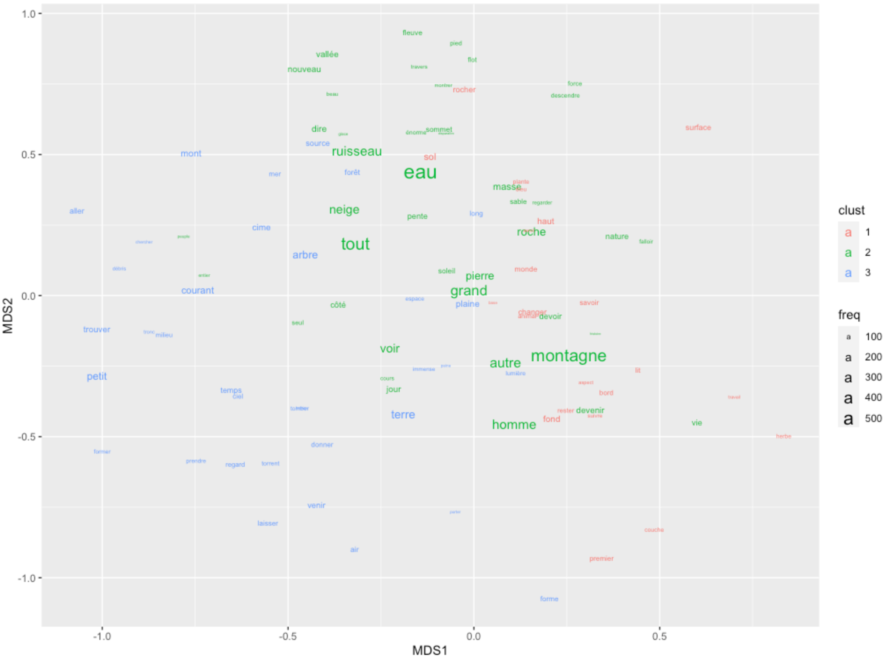

Or an animated look at the first 3 dimensions of the result of the MDS:

```{r}
par3d(windowRect = c(20, 30, 800, 800),zoom=0.7)
text3d(
	temp$MDS1,
	temp$MDS2,
	temp$MDS3,
	temp$lemma,
	color=temp$clust,
	cex=0.8*(temp$freq/min(temp$freq))^0.25,
	pos=4,
	offset=0.6
)
rgl.spheres(temp$MDS1,temp$MDS2,temp$MDS3,temp$lemma,color=temp$clust,r=0.03*(temp$freq/min(temp$freq))^0.25)
bg3d(color="white",fogtype="linear")
# rgl.bbox(color=c("#333377","black"), emission="#333377",specular="#3333FF", shininess=5, alpha=0.8 ) 
movie3d(spin3d(axis = c(0.3, 0.3, 0.3)), movie="mdsscatter_noloop", duration = 20, clean=T, fps=20, dir = basepath)
rgl.close()
system("cd /Users/ourednik/Library/CloudStorage/OneDrive-unine.ch/CoursUNINE/examples/unine_exercice_quanteda gifsicle -l mdsscatter_noloop.gif > mdsscatter.gif"
)
```


#### From MDS to SOM

Now let us transform the five-dimensional semantic space produced by MDS
into a 2D self-organizing map. I'll use a hexagonal grid. To measure our
expectations regarding the coherence of the final map, here are the
averages for each of the five dimensions grid tile:

```{r}
g.somdata <- g.mds.points %>% as.data.frame
g.somgrid <- somgrid(xdim = 9, ydim=14, topo="hexagonal")
g.sommap <- som( 
	g.mds.points, 
  grid=g.somgrid, 
  rlen=600, 
  alpha=c(0.05,0.01)
)
g.sommap_dist <- getCodes(g.sommap) %>% dist
g.sommap_clusters <- fastcluster::hclust(g.sommap_dist)
g.somxydict <- data.table( # construct a dictionary
	pointid=1:nrow(g.sommap$grid$pts), 
	x=g.sommap$grid$pts[,1], 
	y=g.sommap$grid$pts[,2],
	groupe=cutree(g.sommap_clusters,9) %>% as.character
)
par(mfrow = c(1, 5))
for(x in 1:ncol(g.somdata)) {
	plot(
		g.sommap, 
		type = "property", 
		property = getCodes(g.sommap)[,x], 
		main=colnames(g.somdata)[x],
		shape="straight",
		palette.name = viridisLite::inferno
	) 
	add.cluster.boundaries(g.sommap,g.somxydict$groupe,lwd=2)
}
par(mfrow = c(1, 1)) #reset par
```

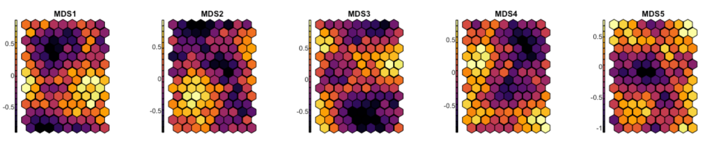

This looks very good; beautiful distribution patterns. They attest that
each dimension is allocated to its special zone of the map.

```{r dpi=150, fig.height=15}

g.somdata.result <- g.somdata %>% as.data.table
g.somdata.result[, lemma := rownames(g.somdata)]
g.somdata.result[, pointid := g.sommap$unit.classif]
setkey(wordfreqs,"feature")
g.somdata.result$freq <- wordfreqs[g.somdata.result$lemma,frequency]
setkey(g.somxydict,pointid)
setkey(g.somdata.result,pointid)
g.somdata.result <- g.somxydict[g.somdata.result]
setorder(g.somdata.result,-freq) # thanks to this order, .(lemmas=c(lemma)[1]) will give the highest element of group
g.somdata.result.aggreg <- lapply(1:3, function(i) g.somdata.result[,.(
	lemma=c(lemma)[i],
	x=c(x)[i],
	y=c(y)[i]-2/3+(i/3), # we want the middle term to be centered, thus -2/3 as starting point
	zlabel=(i),
	freq=c(freq)[i],
	groupe=c(groupe)[i]
),by="pointid"]) %>% rbindlist

ggplot() +
	geom_text(data=g.somdata.result.aggreg, aes(x=x,y=y,label=lemma,color=groupe),show.legend = F) +
	theme_void()
```

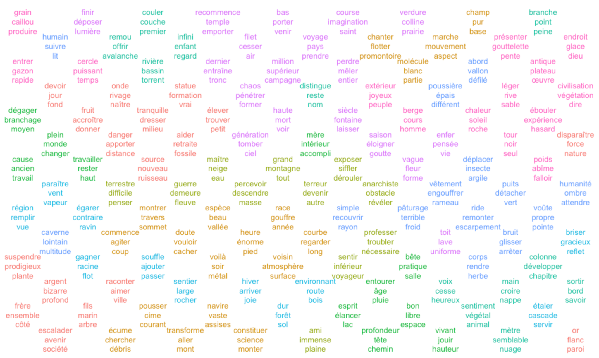

Nevertheless, once you connect the words to their positions, the result
is hard to make sense of. Mathematical coherence of text visualisation
methods isn't a guarantee for interpretable visualizations. Yet they
might yield something intersting with a larger corpus, so you have to
try.

For what it's worth, you can still spot some understandable, and even
interesting aggregates. Pebbles produce grains (*caillou, produire,
grain*). The brothers are together, side by side (f*rère, ensemble,
côté*); they climb the future of society (*escalader, avenir, société*).
The streams form rivers in the basin (r*ivière, bassin, torrent*). The
generation falls from the sky (*génération, tomber, ciel*).

### The biofabric layout

A very nice visualization of graphs can also be achieved with the
["biofabric" layout](http://www.biofabric.org/) by W.J.R., Longabaugh.

```{r}
cutoff <- E(g.top)$weight%>%min + (E(g.top)$weight%>%max - E(g.top)$weight%>%min) * 0.02
g.top.weightOver5 <- g.top %>% activate(edges) %>% filter(weight>cutoff)
g.top.weightOver5 <- delete.vertices(g.top.weightOver5,which(
	degree(g.top.weightOver5,mode="all") < cutoff/3	
)) %>% as_tbl_graph
bioFabric(g.top.weightOver5 %>% slice(1:20))
```

You can also use ggraph to view the biofabric layout: 

```{r}
ggraph(g.top.weightOver5 %>% slice(1:20),layout="fabric", sort.by=node_rank_fabric()) + 
	geom_node_range(aes(colour=group),show.legend = F) +
	geom_edge_span(end_shape = "circle") +
	geom_node_label(aes(x=xmin-5,label=name, color=group),show.legend = F)
```

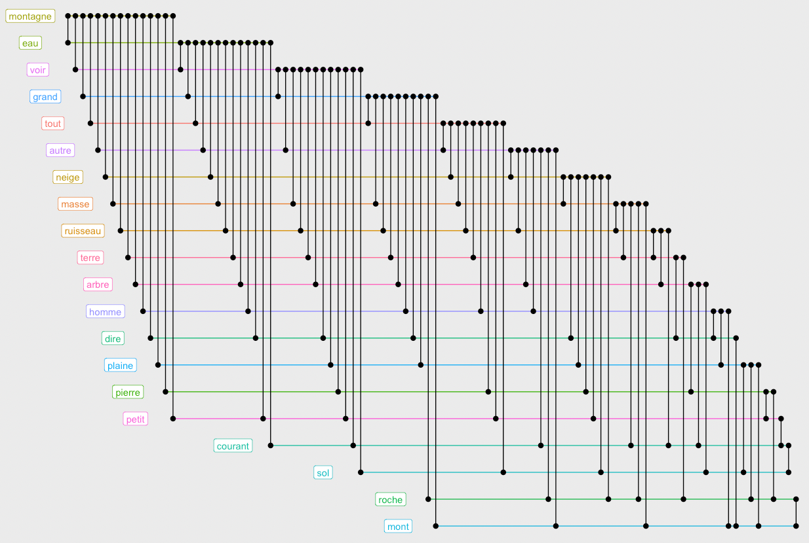

This design allows us to see that the words "montagne" and "eau" occur
in conjunction with almost all others. Which is not very interesting.
Let us remove the most connected words to visualize deeper connections.
You will need to play with the `minedgeweightpct` and
`minvertexdegreepct`values to zoom to more specific connections in your
dataset:

```{r}
minedgeweightpct <- 0.015
minvertexdegreepct <- 0.3
cutoff <- E(g.top)$weight%>%min + (E(g.top)$weight%>%max - E(g.top)$weight%>%min) * minedgeweightpct
g.top.weightOver5 <- g.top %>% activate(edges) %>% filter(weight>cutoff)
g.top.weightOver5 <- delete.vertices(g.top.weightOver5,which(
	degree(g.top.weightOver5, mode="all") > (degree(g.top.weightOver5, mode="all") %>% max * minvertexdegreepct) 
	| degree(g.top.weightOver5, mode="all") < cutoff/3		
)) %>% as_tbl_graph
bioFabric(g.top.weightOver5 %>% slice(1:30))

```

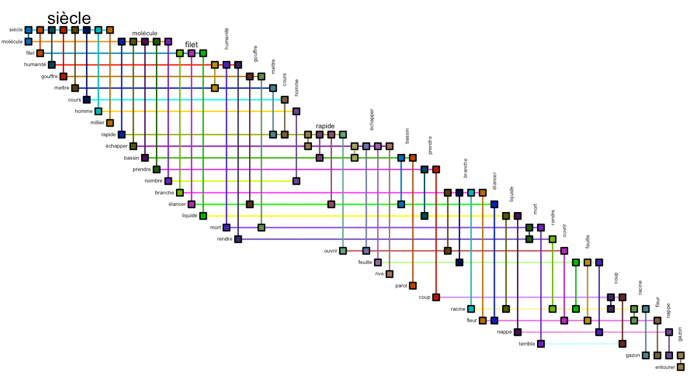

In this closeup, we see that Elisée Reclus regards the *century*
(siècle) as a human and frightening one. It co-occurs with *humanité*,
*homme* and *gouffre*; humanity herself is linked to death. Distinct
from man, though also linked to the century, is the *molecule*, fast
(*rapide*) and escaping (*échapper*). On the far right, we have the
physical environment: *branche*, *racine*, *gazon*, *champ*, *fleur*...


# Word Embeddings

Another way to transform text into a semantic space is to use [word
embedding](https://en.wikipedia.org/wiki/Word_embedding). This approach
also uses the feature coocurrence matrix, but its logic is different. It
creates a multidimensional space in which words are close to each other
not because they appear close to each other in the text, but because
they tend to appear in *similar contexts*. Thus, to fully exploit the
power of word embedding, we will not eliminate any lemma, this time, but
take them all, including punctuation, determinants, adverbs, and other
stopwords:

```{r}
tokens.all <- text.lemmas[, c("doc_id","lemma")][,.(text = paste(lemma, collapse=" ")), by = doc_id] %>% corpus %>% tokens
```

From here on, we can work with the _text2vec_ package.

```{r}
it <- itoken(tokens.all%>%as.list)
vocab <- create_vocabulary(it) # this generates a flat list of tokens
vocab <- prune_vocabulary(vocab,term_count_min = 2)
vectorizer <- vocab_vectorizer(vocab)
tcm <- create_tcm(it, vectorizer, skip_grams_window = 5) # terms coocurrence matrix fast
glove = GlobalVectors$new(rank = 50, x_max = 10)
wv_main = glove$fit_transform(tcm, n_iter = 50, convergence_tol = 0.01, n_threads = ncores)
wv_context = glove$components
word_vectors = wv_main + t(wv_context) 
word_vectors.dt <- word_vectors %>% as.data.table
# Clean up the document now that the distances have been calculated
word_vectors.dt[,lemma:=vocab$term]
word_vectors.dt[,freq:=vocab$term_count]
setkey(word_vectors.dt,lemma)
```

Only now that we have calculated the positions of words in 50-dimensional space based on their complete embeddings, we can remove less interesting parts of speech and stopwords : 

```{r }
text.lemmas.simplified <- text.lemmas[,c("lemma","upos")] %>% as.data.table %>% unique %>% setkey(lemma)
word_vectors.dt <- text.lemmas.simplified[word_vectors.dt][
	upos %in% c("NOUN","PROPN","ADJ","VERB") & 
	!lemma %chin% mystopwords
	,-c("upos")
] %>% unique
```

A 50-dimensional space, of course, cannot be visualized. We need to reduce its dimensionality. We can start by calculating the distances between all pairs of words and by detecting clusters.

```{r}
word_vectors.simplified.df <- word_vectors.dt[,-c("lemma","freq")] %>% as.data.frame
rownames(word_vectors.simplified.df) <- word_vectors.dt$lemma
distance <- dist(word_vectors.simplified.df) # for the rest of the code, we only need the basic distance object
clusters <- hclust(distance) # uses fastcluster package when loaded
```

### Principal Component Analysis

One way to project a multidimensional space into 2 dimensions is the
principal component analysis. The method is linear, meaning you will not
get wild relocations like you would with, for instance, the UMAP
algorithm. UMAP is great to separate clusters but the distances between
words lose some of their more directly interpretable meanings. Of
course, if you want to try out UMAP, do so, it may give interesting
results. But let us stick to the good old PCA here. You could also try
selecting any two dimensions of the n-dimensional word2vec space, but
PCA really helps selecting the most important components of the vector
space, as shows the following scree plot:

```{r }
pc <- prcomp(word_vectors.simplified.df)
screeplot(pc,type="lines",main="Global variance of the word2vec model\nkept in each principal component after the rotation",npcs=length(pc$sdev))
```

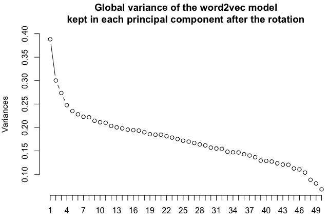

Let us map our words in two dimensions. Doing so, we also transform the
previously calculated clusters into 9 groups, to get a nice 3×3 set of
ggplot facets:

```{r}
pcx <- pc$x %>% as.data.table
pcx[,groupe9:=cutree(clusters,9)%>%as.character] 
pcx[,lemma:=word_vectors.dt$lemma]
pcx[,freq:=word_vectors.dt$freq]
setkey(pcx,"lemma")
pcx <- text.lemmas.simplified[pcx][
	upos %in% c("NOUN","PROPN","ADJ","VERB") & 
	!lemma %chin% mystopwords
	,-c("upos")
] %>% unique

# Get the 30 most frequent words per group
pcx.grouptops <- copy(pcx)
setorder(pcx.grouptops,-freq)
pcx.grouptops <- lapply(1:9,function(i){
	pcx.grouptops[groupe9==i] %>% head(30)
}) %>% rbindlist

ggplot(pcx.grouptops) +
  geom_text(
  	aes(label=lemma,x=PC1,y=PC2,colour=groupe9, size=log(freq)),
  	alpha=0.8
  ) +
	facet_wrap("groupe9",scales = "free") +
	theme_light()

```

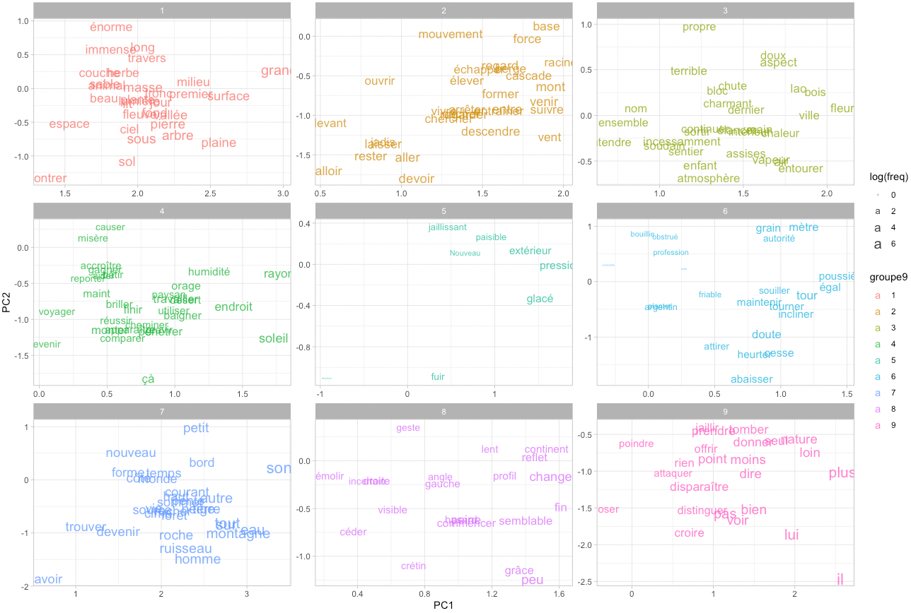

We can also simply map the 200 most frequent words in the same space.

```{r}
ggplot(pcx %>% setorder(-freq) %>% head(150)) +
  geom_text(
  	aes(label=lemma,x=PC1,y=PC2,colour=groupe9, size=log(freq)),
  	alpha=0.8
  )
```

An obvious problem with this representation is that words overlap in clumps, while so much white space remains in the graph. How could we spread the words more evenly while making sure that their proximities remain significant. Self-organizing maps is, again, a potential the answer.

### Self-organizing Map

Yes, self-organizing maps can also be used to reduce the clumping effect
obtained by mapping each word to the first two principal components of
the word2vec matrix.

Let us use again a hexagonal grid, and have a look again on the averages
for each of the first 10 principal components per grid tile:

```{r}
somdata <- pcx[,c(paste0("PC",1:10))] %>% as.data.frame
row.names(somdata) <- pcx$lemma
som_grid <- somgrid(xdim = 9, ydim=14, topo="hexagonal")
sommap <- som( 
	somdata %>% as.matrix, 
  grid=som_grid, 
  rlen=600, 
  alpha=c(0.05,0.01)
)
sommap_dist <- getCodes(sommap) %>% dist
sommap_clusters <- fastcluster::hclust(sommap_dist)
somxydict <- data.table( # construct a dictionary
	pointid=1:nrow(sommap$grid$pts), 
	x=sommap$grid$pts[,1], 
	y=sommap$grid$pts[,2],
	groupe5=cutree(sommap_clusters,5) %>% as.character
)
par(mfrow = c(2, 5))
for(x in 1:ncol(somdata)) {
	plot(
		sommap, 
		type = "property", 
		property = getCodes(sommap)[,x], 
		main=colnames(somdata)[x],
		shape="straight",
		palette.name = viridisLite::inferno
	) 
	add.cluster.boundaries(sommap,somxydict$groupe5,lwd=2)
}
par(mfrow = c(1, 1)) #reset par
```

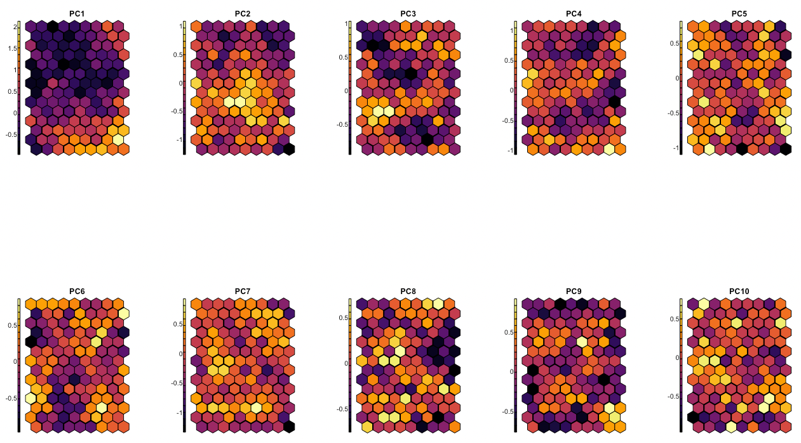

Here, some values are scrambled all across space, but the first 3 to 4
components are definitely taken well care of. The maxima and minima for
these components are organized in coherent neighborhoods.

And here is the word map. We keep the three most frequent words for each
point of the grid:

```{r dpi=150, fig.height=15}

setkey(somxydict,pointid)
pcx[,pointid := sommap$unit.classif]
setkey(pcx,pointid)
pcx2 <- somxydict[pcx]
setorder(pcx2,-freq) # thanks to this order, .(lemmas=c(lemma)[1]) will give the highest element of group
pcx.aggreg <- lapply(1:3, function(i) pcx2[,.(
	lemma=c(lemma)[i],
	x=c(x)[i],
	y=c(y)[i]-2/3+(i/3), # we want the middle term to be centered, thus -2/3 as starting point
	zlabel=(i),
	freq=c(freq)[i],
	groupe5=c(groupe5)[i]
),by="pointid"]) %>% rbindlist

ggplot() +
	geom_text(data=pcx.aggreg, aes(x=x,y=y,label=lemma,color=groupe5),show.legend = F) +
	theme_void()
```

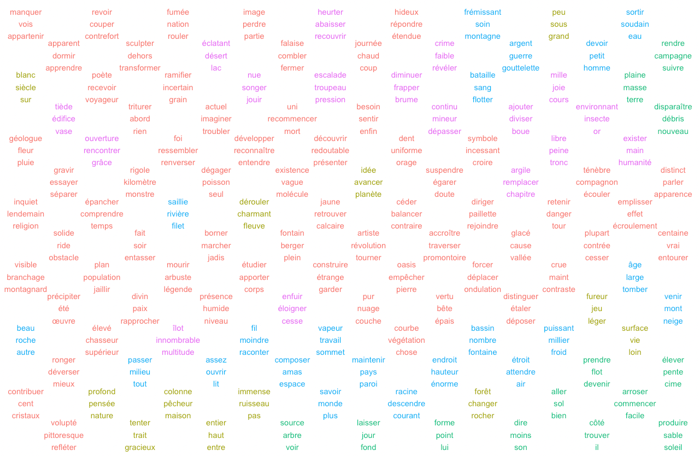

Finally, let us once more add a third dimension to show the frequency of
words.

```{r dpi=300, fig.height=10}
# Prepare raster heights ----
pointheight <- pcx2[,.(
	freq=sum(freq),
	x=c(x)[1],
	y=c(y)[1]
),by="pointid"]
xleft <- 0
xright <- max(pointheight$x)+0.8
yupper <- max(pointheight$y)+1
ylower <- 0
# interpolate the points to a a raster, with sampling frequency nx X ny ---
# Note that the original coordinates of the points are preserved 
pointheight.raster2 <- akima::interp( 
	x = pointheight$x, 
	y = pointheight$y, 
	z = pointheight$freq,
	xo = seq(xleft,xright,by=(xright-xleft)/1500),
	yo = seq(ylower,yupper,by=(yupper-ylower)/3000),
	linear = FALSE,
	extrap = TRUE, # works for non-linear only; if false creates a convex hull that removes points at the edges
	duplicate = "strip"
)
pointheight.raster2.dt <- akima::interp2xyz(pointheight.raster2) %>% as.data.table %>% setnames("z","freq")
if (nrow(pointheight.raster2.dt[freq<0]) > 0) { 	
	# necessary if the interpolation has produced negative values
	pointheight.raster2.dt[,freq:=freq-min(freq,na.rm=TRUE)] # NB: -(-x) = +x
}
pointheight.raster2.dt[is.na(freq),freq:=min(pointheight$freq)]

# terrain_palette <- colorRampPalette(c("#6AA85B", "#D9CC9A", "#FFFFFF"))(256) %>% colorspace::lighten(0.9)
terrain_palette <- colorRampPalette(c("#f0f0f0","white"))(256)
pp <- ggplot() +
	geom_raster(data=pointheight.raster2.dt, aes(x=x, y=y, fill=freq^0.5),interpolate=TRUE,show.legend = F) +
	scale_fill_gradientn(colours=terrain_palette)+
	geom_text(data=pcx.aggreg, aes(x=x,y=y,label=lemma,color=groupe5),show.legend = F) +
	theme_void()
rayshader::plot_gg(
	pp, width=15, height=10, multicore = TRUE,
	raytrace=TRUE, 
	scale = 500, # default is 150
	# preview = TRUE,
	windowsize = c(1600, 1000),
  fov = 70, zoom = 0.4, theta = 0, phi = 90
) 
# rayshader::render_camera(fov = 70, zoom = 0.4, theta = 0, phi = 90)
rayshader::render_snapshot(file.path(basepath,"som3d.png"),width=160, height=100)
rgl.close()
```

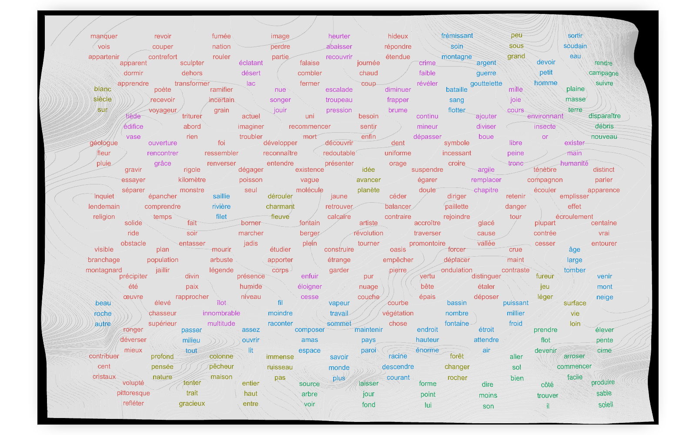